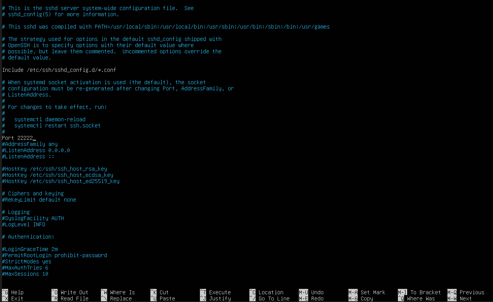
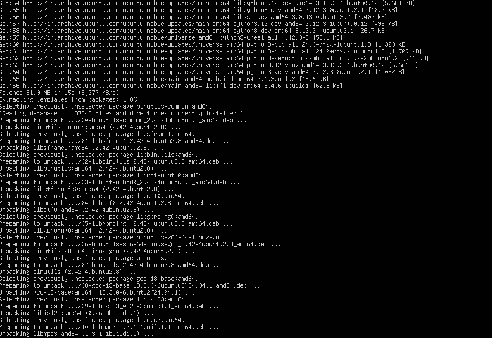
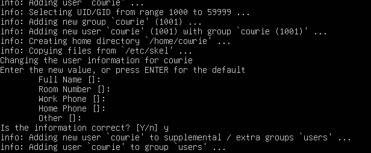
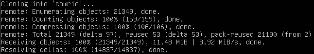
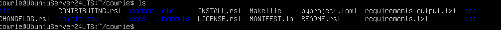
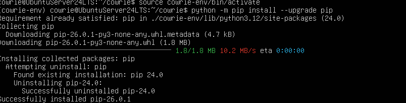
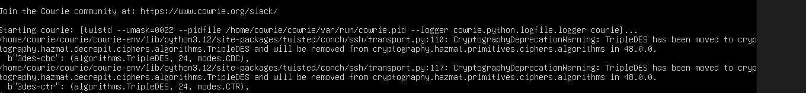
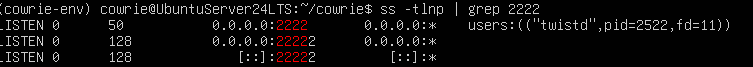

# Cowrie Honeypot - Setup Writeup

## Objective
Set up Cowrie SSH honeypot on an Ubuntu Server VM to capture and log attacker behavior as part of a cybersecurity homelab project.

## Environment
- **Host:** Windows 11, AMD Ryzen 7 8840HS, 16GB RAM
- **Hypervisor:** VirtualBox
- **VM:** Ubuntu Server 24 LTS
- **Network:** NAT (switched to Host-Only post setup)

---

## Step 1: Move OpenSSH to a Different Port

Before setting up Cowrie, OpenSSH must be moved off port 22 so Cowrie can take over.

Edited `/etc/ssh/sshd_config` and changed the port to `22222`.
```bash
sudo nano /etc/ssh/sshd_config
```



### Troubleshooting: ssh.socket Issue

After restarting SSH, the port was still showing as 22. The issue was that `ssh.socket` (systemd socket activation) was running and overriding the config file.
```bash
sudo systemctl stop sshd
# Output: "triggering units still active: ssh.socket"
```

Fixed by disabling the socket and enabling the service directly:
```bash
sudo systemctl disable --now ssh.socket
sudo systemctl enable --now ssh.service
sudo systemctl restart ssh.service
```

Verified the port change:
```bash
sudo ss -tlnp | grep ssh
```

---

## Step 2: Install System Dependencies
```bash
sudo apt-get install git python3-pip python3-venv libssl-dev libffi-dev build-essential libpython3-dev python3-minimal authbind iproute2
```



---

## Step 3: Create Dedicated Cowrie User
```bash
sudo adduser --disabled-password cowrie
sudo su - cowrie
```



---

## Step 4: Clone the Repository
```bash
git clone https://github.com/cowrie/cowrie
cd cowrie
```



---

## Step 5: Set Up Virtual Environment
```bash
python3 -m venv cowrie-env
source cowrie-env/bin/activate
python -m pip install --upgrade pip
python -m pip install -e .
```





---

## Step 6: Start Cowrie
```bash
cowrie start
```



Verified Cowrie is listening on port 2222:
```bash
ss -tlnp | grep 2222
```



---

## Step 7: Configure iptables Redirect

Redirected port 22 traffic to Cowrie on port 2222:
```bash
sudo iptables -t nat -A PREROUTING -p tcp --dport 22 -j REDIRECT --to-port 2222
```

Verified the rule:
```bash
sudo iptables -t nat -L -n -v
```

---

## Step 8: Verify Cowrie is Working

Connected to Cowrie directly on port 2222:
```bash
ssh -p 2222 root@localhost
```

Checked the logs to confirm the connection was captured:
```bash
cat ~/cowrie/var/log/cowrie/cowrie.log
```

---

## Outcome

Cowrie is fully operational and logging SSH connections. Next steps are Wazuh integration for log forwarding and attack simulation from Kali Linux.